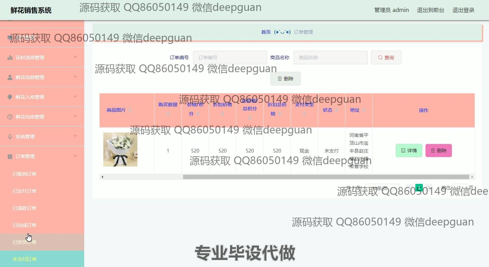

<h1 align="center">前后端分离鲜花销售系统+vue</h1>

## 简介
鲜花销售系统：角色分为管理员、用户；支持用户管理、花材选择、鲜花信息管理、订单管理、入库出库、个人中心等功能，界面简洁直观，支持在线支付和客服交流。    --计算机毕业设计源码；毕设源码；java毕业设计源码

## 联系方式

<h3 align="center">获取完整代码与数据库文件 + 微信：deepguan QQ: 86050149 QQ群: 783742310</h3>

<h3 align="center">可帮忙远程部署 包运行成功！提供远程部署、修改代码、设计文档指导、代码讲解等服务！</h3>

## 功能介绍（完整见运行截图）
管理员： 登录系统，访问个人中心，管理用户信息，进行鲜花信息录入和修改，管理订单状态，包括查看已支付和未支付订单，处理退款请求与订单取消，管理库存入库和出库记录，支持系统设置和权限管理，通过导航栏切换各功能模块，利用搜索功能定位和管理具体订单或商品。

用户： 注册与登录账户，浏览首页商品推荐和鲜花资讯，使用购物车功能选购鲜花，完成在线支付，管理个人资料和多个收货地址，通过订单界面查看和跟踪订单状态，使用客服聊天窗口进行沟通，参与商品评价和反馈，享受简约界面直观购物体验，进行账户充值和余额管理，通过详细搜索快速查找产品。

## 运行截图

本代码来源于网络,仅供学习参考使用!

